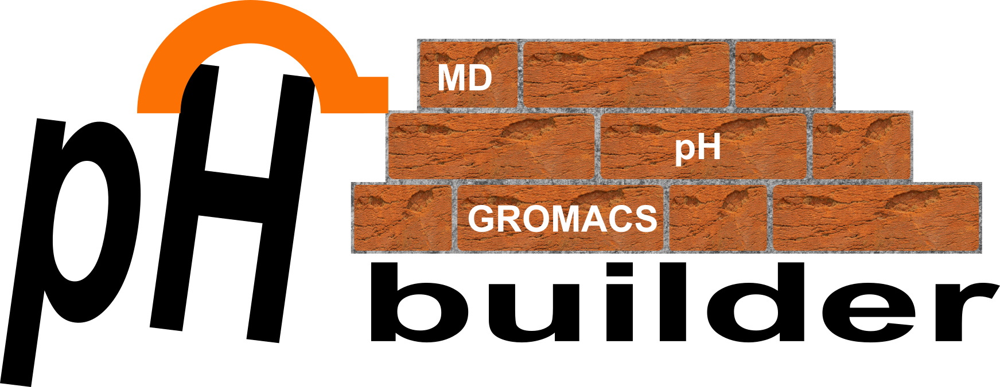

<div style="width: 830px">

[](https://github.com/AntonJansen96/phbuilder/issues)

<p align="center">
  
</p>

phbuilder is a command line tool that automates setting up constant-pH (CpHMD) simulations in [GROMACS](https://www.gromacs.org/).

For the GROMACS CpHMD publications, please see:
* [Scalable Constant pH Molecular Dynamics in GROMACS](https://pubs.acs.org/doi/10.1021/acs.jctc.2c00516).
* [Best Practices in Constant pH MD Simulations: Accuracy and Sampling](https://pubs.acs.org/doi/full/10.1021/acs.jctc.2c00517).

For the publication associated with phbuilder, please see:
* [phbuilder: a tool for efficiently setting up constant pH molecular dynamics simulations in GROMACS]().

## Table of contents

1. [Installation](#installation)
3. [Basic Tool Description](#basic-tool-description)
4. [Basic Workflow](#basic-workflow)
5. [Performing Titrations](#performing-titations)
6. [Performing Parameterizations](#performing-parameterizations)
7. [Running CpHMD simulations on HPC resources](#running-cphmd-simulations-on-hpc-resources)
8. [Synopsis `phbuilder gentopol`](#synopsis-phbuilder-gentopol)
9. [Synopsis `phbuilder neutralize`](#synopsis-phbuilder-neutralize)
10. [Synopsis `phbuilder genparams`](#synopsis-phbuilder-genparams)
11. [Tips and Tricks](#tips-and-tricks)
12. [Frequently Asked Questions](#frequently-asked-questions)

## Installation 

1. To enable GPU acceleration, make sure you first install [CUDA](https://docs.nvidia.com/cuda/cuda-installation-guide-linux/index.html#pre-installation-actions).

2. Download the [gromacs-constantph](https://gitlab.com/gromacs-constantph/) beta build.

3. Build and install using the instructions [here](https://manual.gromacs.org/current/install-guide/index.html). Suggested CMake command:
    ```
    cmake .. -DGMX_BUI`LD_OWN_FFTW=ON -DGMX_GPU=CUDA -DGMX_USE_RDTSCP=ON -DCMAKE_INSTALL_PREFIX=/usr/local/gromacs_constantph
    ```

    NOTE: running `make check` will give multiple failures. This is to be expected for the CpHMD beta version. It is recommended to skip `make check`.

    NOTE: By default, phbuilder will look for the GROMACS CpHMD installation in `/usr/local/gromacs_constantph`. If you install the CpHMD code in a different location, make sure to update this in the phbuilder configuration file `lambdagrouptypes.dat`, or alternatively set `GMXPH_BASEPATH`.

4. Install phbuilder (test version):
    ```
    pip install -i https://test.pypi.org/simple/ --extra-index-url https://pypi.org/simple phbuilder
    ```

5. phbuilder has [argcomplete](https://pypi.org/project/argcomplete/) functionality. To make sure this works, run:
    ```
    activate-global-python-argcomplete --user 
    ```
    once and reload your terminal.

<!-- ## Dependencies and configuration file locations

In addition to the command line input provided by the user, phbuilder has a few (file) dependencies. These dependencies are outlined here.

1. phbuilder requires that GROMACS CpHMD beta build is installed. See installation step 3.
2. phbuilder uses a central configuration file `lambdagrouptypes.dat`. The default version of this file is located in the installation directory of the phbuilder Python package, i.e. `/path/to/lib/python3.xx/site-packages/phbuilder/ffield`. -->

## Basic Tool Description

phbuilder is a command line tool that automates setting up constant-pH (CpHMD) simulations in [GROMACS](https://www.gromacs.org/). phbuilder consists of three (sub)tools: gentopol, neutralize, and genparams. Each tool fulfills a specific function in the setup process. gentopol allows you to select which sites to make titratable, and in which initial lambda (protonation) state they should be. gentopol also regenerates your system topology using the modified CHARMM36m CpHMD force field. neutralize adds the appropriate number of ions and buffer particles to ensure a net-neutral simulations. genparams generates the CpHMD-specific `.mdp` files and `.ndx` file. Functionality for setting up titration and paramterization is also provided with the help of included stand-alone Python scripts.

## Basic Workflow

#### 1. Prepare your structure file. 
This is an important step, and it applies especially to structures that are straight from [RCSB](https://www.rcsb.org/).

* Make sure your structure only contains one MODEL, does not contain alternate location indicators, does not miss atoms or residues, etc.
* Basically, if you cannot use your structure to succesfully set up normal MD simulations with GROMACS, you should first make sure this works before continuing.
* It is also important that your molecules(s) containing the titratable groups are *at the top* of the structure file. So first the titratable protein(s), and only then solvent, ions, lipids, etc.
* It is also strongly recommended that every (non-ion / water) molecule has a chain identifier. If you have only one chain you can simply set everything to A.

#### 2. Make sure that topologies are available for all moleculetypes present in your structure file.

phbuilder cannot provide topology information for non-standard residue types (those not included by default in CHARMM36m → not present in `residuetypes.dat`). In such cases, the user is expected to provide separate topology (`.itp`) files. Additionally, be aware that `gmx pdb2gmx` cannot add hydrogens to non-standard residues, so you either have to add an entry to the force field `.hdb` file, or make sure that hydrogens are already present in the structure for this residue type. For more information, see the relevant [GROMACS documentation](https://manual.gromacs.org/current/how-to/topology.html). See also parameterization steps 1 and 2.

#### 3. Use `phbuilder gentopol` to (re)generate the CpHMD topology.

First, decide which residues you want to have titratable, and in which protonation state those residues should be at $t = 0$ (essentially which initial $\lambda$-values they should have). If you do not care about this, you can use the `-ph <ph>` flag to have `gentopol` automatically choose the appropriate initial $\lambda$-values based on the specified pH and the (macroscopic) pKas of the lambdagrouptypes.

Manually choose which residues to make titratable and in which initial state, and (re)generate the topology:

```
phbuilder gentopol -f input.pdb
``` 

Alternatively, you can set the -ph flag and simply run:

```
phbuilder gentopol -f input.pdb -ph <ph>
```

In the latter case, the initial $\lambda$-values will be guessed based on the specified system pH, together with the (macroscopic) pKa specified in `lambdagrouptypes.dat`.

#### 4. Add a periodic box and solvent (if not already present).

Periodic box (see [gmx editconf](https://manual.gromacs.org/documentation/current/onlinehelp/gmx-editconf.html)):

```
gmx editconf -f phprocessed.pdb -o box.pdb -bt cubic -d 1.5
```

Solvent (see [gmx solvate](https://manual.gromacs.org/documentation/current/onlinehelp/gmx-solvate.html)):

```
gmx solvate -cp box.pdb -p topol.top -o solvated.pdb
```

#### 5. (Optional) Remove incorrectly placed water molecules.

`gmx solvate` is a relatively basic program and will by default add solvent simply based on the van der Waals radii of the solute. This can lead to water molecules being generated in locations where there should not be any (e.g. in hydrophobic pockets in your protein). It is good practice to check for this, and if this occurs in your system, we recommend you to utilize the included [clean_after_solvate.py](scripts/clean_after_solvate.py) script to clean up your system.

#### 6. Use `phbuilder neutralize` to ensure a net-neutral simulation system.

Add the appropriate number of positive/negative ions and buffers to ensure a net-neutral system:
```
phbuilder neutralize -f solvated.pdb
```
Alternatively, if you want a specific ion concentration (in mol/L = mmol/mL) and/or a specific number of buffer particles , you could do:
```
phbuilder neutralize -f solvated.pdb -conc 0.15 -nbufs 20
```
NOTE: `phbuilder neutralize` neutralizes the system by <i>adding</i> ions to the input structure, not by removing or rebalancing existing ones. This implies the final ion concentration in your output files will never be lower than the ion concentration in your input file. For this reason, you should not add any ions to your system when embedding membrane systems with e.g. CHARMM-GUI but rather let phbuilder take care of this.

#### 7. Use `phbuilder genparams` to generate the `.mdp` and `.ndx` files required for CpHMD.

At this point, if everything went correctly both your structure and topology file(s) should be completed and constitute a net-neutral system when running CpHMD. What is now left is the actual simulation part: energy minimization, equilibration and production using the correct CpHMD parameters.

Generate the `.mdp` files for EM/EQ/MD, including the CpHMD parameters for a specific simulation pH: 

```
phbuilder genparams -f phneutral.pdb -ph 4.0 
```

By default, the following files will be written:
* `EM.mdp`
* `NVT.mdp`
* `NPT.mdp`
* `MD.mdp`
* `index.ndx`

NOTE: If you previously used the auto feature (`-ph` flag) for `gentopol`, the pH you specify for `genparams` should be equal to this.

#### 8. Check the generated files and modify parameters specific to your system as required. 

The `.mdp` files generated by `genparams` are generic files for CHARMM36m. They should work for basic simulations, but for advanced stuff like semi-isotropic pressure coupling for membranes, pull code, AWH, more gradual equilibration, etc. you should modify these generic files accordingly. Also note that by default no position restraints are used for the protein during NVT and NPT coupling.

#### 9. Perform equilibration.

```
#!/bin/bash

# GROMACS version to use:
source /usr/local/gromacs_constantph/bin/GMXRC

gmx grompp -f EM.mdp -c phneutral.pdb -p topol.top -n index.ndx -o EM.tpr -maxwarn 1
gmx mdrun -v -deffnm EM -c EM.pdb

gmx grompp -f NVT.mdp -c EM.pdb -p topol.top -n index.ndx -o NVT.tpr
gmx mdrun -v -deffnm NVT -c NVT.pdb -npme 0

gmx grompp -f NPT.mdp -c NVT.pdb -p topol.top -n index.ndx -o NPT.tpr
gmx mdrun -v -deffnm NPT -c NPT.pdb -npme 0
```

#### 10. Perform the CpHMD production simulation.

```
#!/bin/bash

# GROMACS version to use:
source /usr/local/gromacs_constantph/bin/GMXRC

gmx grompp -f MD.mdp -c NPT.pdb -p topol.top -n index.ndx -o MD.tpr
gmx mdrun -v -deffnm MD -c MD.pdb -x MD.xtc -npme 0
```

#### 11. Extract the trajectories of the $\lambda$-coordinates.

After the CpHMD simulation is completed one can extrate the $\lambda$-coordinate trajectories from the `.edr` file in the form of readable `.xvg` files using the following command:

```
gmx cphmd -s MD.tpr -e MD.edr -numplot 1
```

## Performing titations

Performing a computational titration is helpful for determining the microscopic pKas of titratable sites. After steps 1 to 9 of the basic workflow have been completed, one can use the included [create_titration.py](scripts/create_titration.py) to setup a titration. For example, the command:

```
create_titration.py -f MD.mdp -c NPT.pdb -p topol.top -n index.ndx -pH 1:10:1 -nr 2
```

creates directories corresponding to pH 1 to 9, with each subdirectory containing two replicas (each containing the appropriate input files for `gmx mdrun`).

## Performing parameterizations

The following section describes a procedure for parameterizing (new) *two-state* ligands for CpHMD simulations. For convenience, we will use the word ligand to refer to any new lambdagrouptype. In this workflow, we will consider parameterizing arginine as an example. As in our previous work, for amino acid paramterization we use capped tripeptides. Note that performing parameterizations correctly is relatively complicated, and the reader is advised to check [Scalable Constant pH Molecular Dynamics in GROMACS](https://pubs.acs.org/doi/10.1021/acs.jctc.2c00516) for more information on parameterization in CpHMD as well as [phbuilder: a tool for efficiently setting up constant-pH simulations in GROMACS](). Here, we will use a two-step procedure introduced in phbuilder paper.

#### 1. Prepare the residuetype topology.

[gmx pdb2gmx](https://manual.gromacs.org/documentation/current/onlinehelp/gmx-pdb2gmx.html) cannot create topologies for non-standard residuetypes, so you most likely have to provide your own `.itp` file. The fields in those `.itp` file should follow the following:

The names in the [ atoms ] section should reflect the titratable name of the residue (in our case ARGT):

```
[ atoms ]
; nr	type	resnr	residu	atom	cgnr	charge	mass
17        NH1      3   ARGT      N     13      -0.47     14.007
etc.
```

Furthermore, at the end of the `.itp` file there should be a position restraining section:

```
#ifdef POSRES
#include "posre.itp"
#endif
```

Where the ifdef must be POSRES. The posre.itp file should contain the specific atom(s) of the ligand you want to restrain, e.g. posre.itp:

```
[ position_restraints ]
;  i funct       fcx        fcy        fcz
19  1  1000  1000  1000
```

will position restrain atom 19 (of moleculetype ARGT). Position restraining during the calibration is required to avoid (strong) interactions between the titratable atoms and the neutralizing buffer particle (by preventing them from moving too close together in the simulation box). If the ligand and buffer particle accidentally get close to each other in some of the calibration runs, the resulting **dVdl** coefficients will be significantly affected. It is also important to remember while selecting atoms for which positions are restrained, that we want to keep the distance between the titratable group and the buffer particle large, but at the same time we want to sample as much orientational configurations as possible. Thus, in the case of ARGT we only fix the $\text{C}_\alpha$ atom of arginine. The suitable selection of atoms to restrain is system-dependent and therefore the responsibility of the user.

#### 2. Modify the force field

In addition to providing and setting up your .itp file, you will likely have to make an addition to the CpHMD force field. This possibly includes new atom, bond, pair, angle, and dihedral types not present in the standard force field, but present in ligand topology. phbuilder does not take care of this and modifying the force field is the responsibility of the user.

#### 3. Place a (copy of the default) lambdagrouptypes.dat file in your working directory.

Doing so will override the default file, and this will allow you to define custom lambdagrouptypes. To the lambdagrouptypes.dat (in your working dir) add the parameters corresponding to the new type. For ARGT:

```
[ ARGT ]
incl   = ARG
atoms  = CD NE HE CZ NH1 HH11 HH12 NH2 HH21 HH22
qqA    = 0.20 -0.70 0.44 0.64 -0.80 0.46 0.46 -0.80 0.46 0.46
pKa_1  = 10.7
qqB_1  = -0.11 -0.54 0.36 0.59 -0.91 0.37 0.00 -0.60 0.33 0.33
dvdl_1 = 0.
```

dvdl_1 is initially set to zero as this is the parameter we are going to obtain during the calibration.

#### 4. Perform basic workflow steps 1 to 5 to obtain a solvate structure.

Make sure to set the initial lambda equal to the *protonated* state. Next, perform the neutralization step setting `-nbufs = 1 -rmin 2.0`:

```
phbuilder neutralize -f solvated.pdb -nbufs 1 -rmin 2.0
```

#### 5. Generate .mdp files for EM/EQ/MD in calibration mode.

This can be done by setting the additional `-cal` flag for genparams:

```
phbuilder genparams -f phneutral.pdb -ph 4.0 -cal
```

Setting the `-cal` flag will modify the resulting .mdp files. It will not only set 
```
lambda-dynamics-calibration = yes
```
but also add
```
define = -DPOSRES -DPOSRES_BUF
```
position restraints. Here, `DPOSRES` corresponds to the ligand atom(s) as described in step 1, and `DPOSRES_BUF` corresponds to the buffer. Finally, setting the `-cal` flag modifies the range and initial lambda for the buffer.

#### 6. Perform basic workflow steps 7-9 (check generic .mdp files and perform EM+EQ).

#### 7. Use the included [create_parameterization.py](scripts/create_parameterization.py) to setup the parameterization runs.

For example, the command:

```
create_parameterization.py -f MD.mdp -c NPT.pdb -r NPT.pdb -p topol.top -n index.ndx
```

creates directories corresponding to different $\lambda$-values, each containing a `.tpr` run input file for `gmx mdrun`. The 2-step protocol assumes that first, short paramterization runs are conducted, followed by reweighting of long 100 nanasecond sampling rus of the ligand in a box (more on that later). We recommend using this 2-step protocol, since it is easier to obtain satisfactory **dvdl** coefficients. Thus, we run only 13 paramterization runs for only 1 nanosecond.

#### 8. Perform the parameterization simulations.

#### 9. Extract the dVdl values from the parameterization runs.

Run the command:

```
gmx cphmd -s run.tpr -e run.edr -dvdl --coordinate no
```

This will yield a file `cphmd-dvdl-1-2.xvg` for which the second column contains the dVdl values of parameterized group. 

#### 10. Use [fit_parameterization.py](scripts/fit_parameterization.py) to obtain the initial guess for the dV/dl coefficients for ATPT.

The general help for `fit_parameterization.py` is as follows:

```
This script will find optimal parameters for parameterised group. It can work in two modes: (i) paramterization, and (ii)
reweighing. In the paramterization mode the script will fit optimal polinomial todvdl computed for a set of fixed
lambda-s. In the reweighing mode the script will analyse the distributions of lambda-coordinate and adjust the
coefficients in order to get flat distributions. As an output, the script will provide entries for lambdagrouptypes.dat
and .mdp files.

options:
    -h, --help            show this help message and exit
    -f MDP, --mdp MDP     Input .mdp file
    -i PREFIX, --prefix PREFIX
                        Prefix of input folders. Default r for paramterization, s for reweighing
    -m {p,s}, --mode {p,s}
                        Input topology file
    -nr NREPLICAS, --nreplicas NREPLICAS
                        Number of replicas run for reweighing. Default is 10
    -l LAMBDAFILE, --lambdafile LAMBDAFILE
                        The path to lambdagrouptypes.dat file. By default the script will search a file in the current
                        directory
    -g GROUP, --group GROUP
                        Name of the group for paramterization
    -fo FITORDER, --fitorder FITORDER
                        Fitting order. Default value is 5
    -o OUT, --out OUT     Name of the outputfile
```

To get the initial guess for dvdl coefficients `fit_parameterization.py` needs to be run in the parameterization mode:

```
python fit_parameterization.py -f MD.mdp -m p -g ARGT
```

As an output `fit_parameterization.py` gives a file where and updated entry for `lambdagrouptypes.dat` and `.mdp` files are provided.

#### 11. Add the obtained dvdl_1 coefficients to the lambdagrouptypes.dat.

This can be either the default or the one in your working directory.

#### 12. Use inverse-Boltzmann to refine the parameterization.

With the obtained coefficients we now need to run 10 (100ns) replicas of the ligand in a box of water. For this you can simply follow the basic workflow, but you should set simulation pH = ligand pKa, and bias barrier height to 0 kJ/mol (`dwpE = 0`). When plotting the resulting $\lambda$-trajectories as a histogram, one should observe approximately flat distributions as Edwp = 0 implies no contribution from $V_{\text{bias}}$, and pH = pKa implies no contribution from $V_{\text{pH}}$, leaving only $V_{\text{ff}}$ and $V_{\text{corr}}$, which should exactly cancel out if parameterization was succesful. However, due to poor sampling efficiency during parameterization, those distributions are not flat even after longer parameterization runs. To overcome that, we will have to update the dvdl coefficients by adding the correction which should flatten the distribution. The correction for dvdl is computed as the derivative of $U(\lambda)$, where $U$ is the Boltzmann inversion of the distribution $p(\lambda)$: $U = -R T \log(p)$. To get this correction `fit_parameterization.py` needs to be run in reweighing mode:

```
python fit_paramterization.py -f MD.mdp -m s -g ARGT
```

#### 13. Perform simulations with the updated coefficient to check that the distributions are now flat.

The reweighing can be repeated several times, but usually one repetition is enough. Once it has been observed that the distributions are flat, you are ready to use the parameterized ligand for CpHMD simulations. If not, there might be mistakes in your parameterization procedure, you might need to use a higher-order fit, or there are sampling issues and you might need to modify (bonded) parameters.

## Running CpHMD simulations on HPC resources

To run CpHMD simulations on cluster (backend) nodes (with GPU support) you will likely have to compile the CpHMD beta version yourself. For this we suggest the following batch script (modify as needed):

```
#!/bin/bash

#SBATCH --time=2-00:00:00
#SBATCH --nodes=1
#SBATCH -p <somePartition>
#SBATCH --job-name=<someJobName>
#SBATCH --mail-user=<someEmail>
#SBATCH --mail-type=ALL
#SBATCH -G 1

# LOAD MODULES

module load cmake/latest
module load gcc/7.4
module load cuda/10.2

# COMPILE GROMACS CPHMD CODE ON NODE SCRATCH

simdir="$PWD"
builddir="/scratch/$USER/$SLURM_JOBID/build"
mkdir -p "$builddir"
cd "$builddir"
cp ~/gromacs-constantph .
CC=gcc-7 CXX=g++-7 cmake ./gromacs-constantph -DGMX_USE_RDTSCP=ON -DCMAKE_INSTALL_PREFIX=${PWD}/.. -DGMX_BUILD_OWN_FFTW=ON -DGMX_GPU=CUDA
make -j 12
make install -j 12
cd ..
source ${PWD}/bin/GMXRC

# RUN SIMULATION

cd "$simdir"

gmx grompp -f MD.mdp -c NPT.pdb -p topol.top -n index.ndx -o MD.tpr
gmx mdrun -deffnm MD -x MD.xtc -npme 0 -nt $SLURM_JOB_CPUS_PER_NODE

```

This is assuming you have the gromacs-constantph code located in your home `~` directory.

## Synopsis `phbuilder gentopol`

```
phbuilder gentopol [-h] -f FILE [-o OUTPUT] [-list LIST] [-ph PH] [-v]
```

#### DESCRIPTION

gentopol encapsulates [gmx pdb2gmx](https://manual.gromacs.org/current/onlinehelp/gmx-pdb2gmx.html), allows you to select which residues to make titratable, and allows you to set the initial lambda values (protonation states) for the titratable sites. It also (re)generate the topology for your system using our modified version of the CHARMM36m force field. This is necessary as some dihedral parameters were modified for titratable residues ([see](https://pubs.acs.org/doi/full/10.1021/acs.jctc.2c00517)). gentopol by default allows you to interactively set the initial lambda value (protonation state) for each residue associated with a defined lambdagrouptype. This behavior can be automated by setting the `-ph <ph>` flag. In this case, every residue associated with a defined lambdagrouptype will automatically be made titratable, and the initial lambda values will be guessed based on the specified `ph`, together with the pKa defined in the `lambdagrouptypes.dat` file. Note that you should use the same pH value for genparams.

#### LIMITATIONS

* It is important that your protein(s)/molecule(s) containing the titratable groups is *at the top* of your structure file. So first the titratable protein(s), and only then solvent, ions, lipids, etc.

OPTIONS

| Flag___      | Description    |
|--------------|----------------|
| `-f`         | [\<.pdb/.gro>] (required) <br /> Specify input structure file. | 
| `-o`         | [\<.pdb/.gro>] (phprocessed.pdb) <br /> Specify output structure file. | 
| `-ph`        | [\<real>] <br /> Use automatic mode and specify the simulation pH to base guess for initial lambda values on. |
| `-list`      | [\<.txt>] <br /> Provide a subset of resid(ue)s to consider. Helpful if you do not want to manually go through many (unimportant) residues. |
| `-v`         | (no) <br /> Be more verbose. |

## Synopsis `phbuilder neutralize`

```
phbuilder neutralize [-h] -f FILE [-p TOPOL] [-o OUTPUT] [-solname SOLNAME] [-pname PNAME] [-nname NNAME] [-conc CONC] [-nbufs NBUFS] [-v]
```

#### DESCRIPTION

The purpose of this tool is to ensure a charge-neutral system by adding the appropriate number of ions and buffer particles.

#### LIMITATIONS

* phbuilder neutralize only keeps track of one type of positive (default NA), and one type of negative (default CL) ion. If you have either no ions or only NA and CL in your input structure, things should work. If you have or want to use a different type, you can use the `-pname` and `-nname` options (see below). If you have or want multiple different types of ions in your system, phbuilder is not guaranteed to work.
* Similar to [gmx genion](https://manual.gromacs.org/current/onlinehelp/gmx-genion.html), phbuilder neutralize neutralizes the system by *adding* ions to the input structure, not by removing or rebalancing existing ones. This implies the ion concentration in your output files cannot and will not be lower than the ion concentration in your input file.

#### OPTIONS

| Flag_____    | Description    |
|--------------|----------------|
| `-f`         | [\<.pdb/.gro>] (required) <br /> Specify input structure file. | 
| `-p`         | [\<.top>] (topol.top) <br /> Specify input topology file. |
| `-o`         | [\<.pdb/.gro>] (phneutral.pdb) <br /> Specify output structure file. |
| `-solname`   | [\<string>] (SOL) <br /> Specify solvent name (of which to replace molecules with ions and buffers). |
| `-pname`     | [\<string>] (NA) <br /> Specify name of positive ion to use. Analogous to [gmx genion](https://manual.gromacs.org/current/onlinehelp/gmx-genion.html).|
| `-nname`     | [\<string>] (CL) <br /> Specify name of negative ion to use. Analogous to [gmx genion](https://manual.gromacs.org/current/onlinehelp/gmx-genion.html). |
| `-conc`      | [\<real>] (0.0) <br /> Specify ion concentration in mol/L. Analogous to [gmx genion](https://manual.gromacs.org/current/onlinehelp/gmx-genion.html) but will use the solvent volume for calculating the required number of ions, not the periodic box volume as genion does. |
| `-nbufs`     | [\<int>] <br /> Manually specify the number of buffer particles to add. If this flag is not set, a (more generous than necessarily required) estimate will be made based on the number of titratable sites. Currently $N_{\text{buf}} = N_{\text{sites}} / 2q_{\text{max}}$ with $q_{\text{max}} = 0.5$. |
| `-rmin`      | [\<real>] (0.6) <br /> Set the minimum distance the ions and buffers should be placed from the solute. Analogous to [gmx genion](https://manual.gromacs.org/current/onlinehelp/gmx-genion.html).
| `-v`         | (no) <br /> Be more verbose. |

## Synopsis `phbuilder genparams`

```
phbuilder genparams [-h] -f FILE -ph PH [-mdp MDP] [-ndx NDX] [-nstout NSTOUT] [-dwpE DWPE] [-inter] [-v]
```

#### DESCRIPTION

`genparams` generates the `.mdp` and files, including all the required constant-pH parameters as well as the required `index.ndx` file. `genparams` requires the existence of a `phrecord.dat` (created when running `gentopol`) file for setting the initial $\lambda$-values.

#### OPTIONS

| Flag<span style="color:white">____</span> | Description    |
|--------------|----------------|
| `-f`         | [\<.pdb/.gro>] (required) <br /> Specify input structure file. |
| `-ph`        | [\<real>] (required) <br /> Specify simulation pH. |
| `-mdp`       | [\<.mdp>] (MD.mdp) <br /> Specify .mdp file for the constant-pH parameters to be appended to. If the specified file does not exist, the .mdp file will be generated from scratch. Note that this only applies to production (MD), for energy minimization (EM) and equilibration (NVT/NPT), the .mdp files will be generated from scratch regardless. |
| `-ndx`       | [\<.idx>] (index.ndx) <br /> Specify .ndx file for the constant-pH (lambda) groups to be appended to. If the specified file does not exist, the .ndx file will be generated from scratch. |
| `-nstout`    | [\<int>] (500) <br /> Specify output frequency for the $\lambda$-files. 500 is large enough for subsequent frames to be uncoupled.
| `-dwpE`      | [\<real>] (7.5) <br /> Specify default height of bias potential barrier in kJ/mol. 7.5 should be large enough in most cases, but if you observe a lambda coordinate spending a significant amount of time between physical ($\lambda = 0, 1$) states, you should manually increase this (either directly in the .mdp file or by setting the `-inter` flag).
| `-inter`     | (no) <br /> If this flag is set, the user can manually specify the height of the bias potential barrier (in kJ/mol) for every titratable group.
| `-cal`       | (no) <br /> If this flag is set, the CpHMD simulation will be run in calibration mode: forces on the lambdas are computed, but they will not be updated. This is used for calibration purposes. |
| `-v`         | (no) <br /> Be more verbose. |

## Tips and Tricks

To be expanded.

## Frequently Asked Questions

To be expanded.
