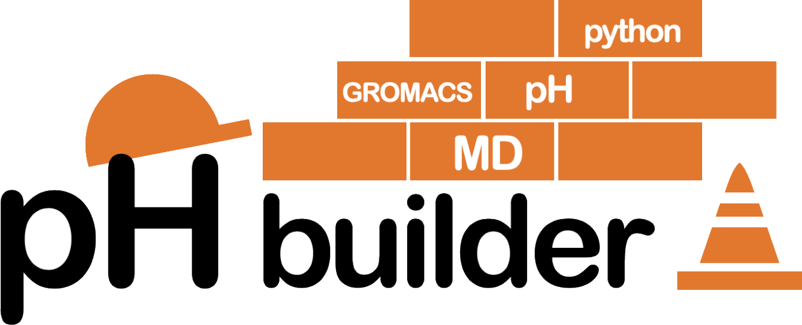
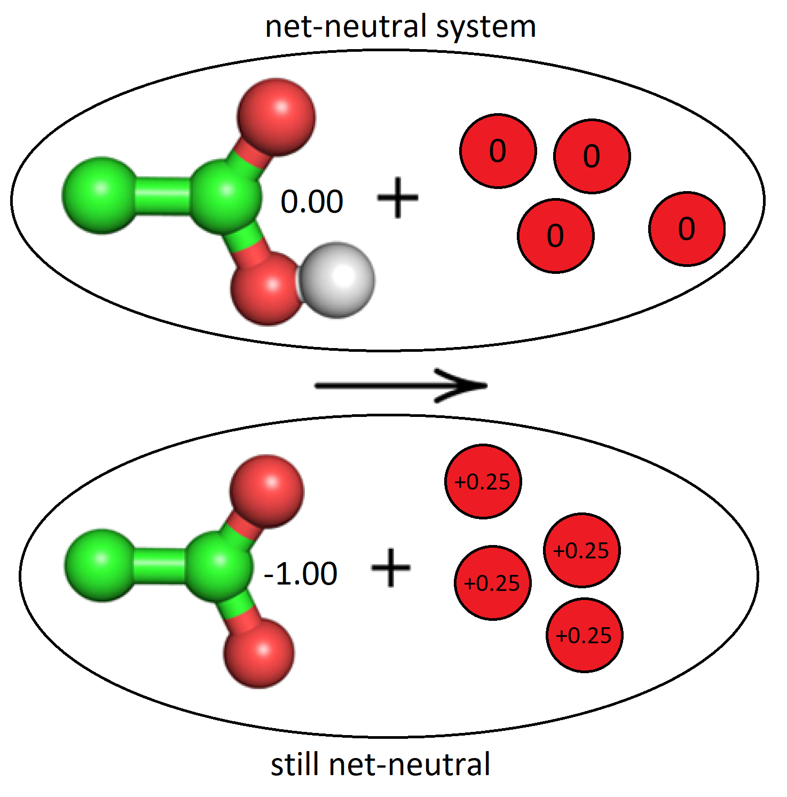
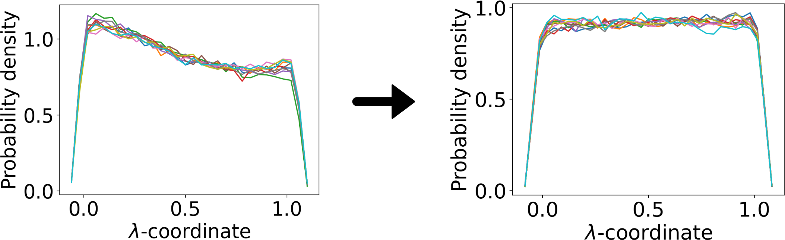

<div style="width: 830px">

[](https://gitlab.com/gromacs-constantph/phbuilder/-/issues)

<p align="center">
  
</p>

phbuilder is a command line tool that automates setting up constant-pH (CpHMD) simulations in [GROMACS](https://www.gromacs.org/).<br>
phbuilder is developed by Anton Jansen, Pavel Buslaev, Noora Aho, Gerrit Groenhof, and Berk Hess.

**For questions, bug reports, and feature requests, please use the [issues](https://gitlab.com/gromacs-constantph/phbuilder/-/issues) section.**<br>
For version and release information, please reference the [RELEASE.md](RELEASE.md) file.

For the GROMACS CpHMD publications, please see:
* [Scalable Constant pH Molecular Dynamics in GROMACS](https://pubs.acs.org/doi/10.1021/acs.jctc.2c00516).
* [Best Practices in Constant pH MD Simulations: Accuracy and Sampling](https://pubs.acs.org/doi/full/10.1021/acs.jctc.2c00517).

For the publication associated with phbuilder, please see:
* [phbuilder: a tool for efficiently setting up constant pH molecular dynamics simulations in GROMACS](https://chemrxiv.org/engage/chemrxiv/article-details/64d4d5af69bfb8925ab380a4).
* For examples of CpHMD simulation set up with phbuilder, have a look at the publication's [simulation input files](https://www.dropbox.com/sh/86bh072wr6dt8zm/AAASu276yeRejI15UweyAXnga?dl=0).

# Table of contents

1. [Installation](#installation)
2. [Description](#description)
3. [Basic Workflow](#basic-workflow)
4. [Performing Titrations](#performing-titrations)
5. [Performing Parameterizations](#performing-parameterizations)
6. [Running CpHMD simulations on HPC resources](#running-cphmd-simulations-on-hpc-resources)
7. [Synopsis `phbuilder gentopol`](#synopsis-phbuilder-gentopol)
8. [Synopsis `phbuilder neutralize`](#synopsis-phbuilder-neutralize)
9. [Synopsis `phbuilder genparams`](#synopsis-phbuilder-genparams)
10. [Tips, Tricks, and FAQ](#tips-tricks-and-faq)

# Installation

1. To enable GPU acceleration, make sure you first install [CUDA](https://docs.nvidia.com/cuda/cuda-installation-guide-linux/index.html#pre-installation-actions).

2. Download the [gromacs-constantph](https://gitlab.com/gromacs-constantph/constantph/) beta.

3. Build and install using the instructions [here](https://manual.gromacs.org/current/install-guide/index.html). Suggested CMake command:
    ```
    cmake .. -DGMX_BUILD_OWN_FFTW=ON -DGMX_GPU=CUDA -DGMX_USE_RDTSCP=ON -DCMAKE_INSTALL_PREFIX=/usr/local/gromacs_constantph
    ```

    NOTE: if you run into compilation issues, GCC 10.2 and CUDA 11.2.1 have been proven to work.

    NOTE: running `make check` will give multiple failures. This is to be expected for the CpHMD beta. It is recommended to skip `make check`.

    NOTE: it is the responsibility of the user to make sure the GROMACS constant-pH install is correctly sourced / loaded in the user environment when running phbuilder. `gentopol` and `genparams` will probably work with a normal GROMACS install as well, but the constant-pH install MUST be active in order for `neutralize` to work correctly.

4. Install phbuilder:
    ```
    pip install phbuilder
    ```

    NOTE: Python 3.8 or newer is required.

5. phbuilder has [argcomplete](https://pypi.org/project/argcomplete/) functionality. To make sure this works, run:
    ```
    activate-global-python-argcomplete --user 
    ```
    once and reload your terminal.

# Description

phbuilder is a command line tool that automates setting up constant-pH (CpHMD) simulations in [GROMACS](https://www.gromacs.org/). phbuilder consists of three (sub)tools: `gentopol`, `neutralize`, and `genparams`. Each tool fulfills a specific function in the setup process. `gentopol` allows you to select which residues to make titratable and which initial lambda (protonation) state they should have. `gentopol` also (re)generates the system topology using the modified CHARMM36m CpHMD force field ([why?](https://pubs.acs.org/doi/full/10.1021/acs.jctc.2c00517)). `neutralize` adds the appropriate number of ions and buffer particles to ensure a net-neutral simulation, and `genparams` generates the CpHMD-specific `.mdp` and `.ndx` files. Functionality for setting up titration and parameterization is also provided with the help of included stand-alone Python scripts.

Out of the box, phbuilder comes with the force field and CpHMD topology parameters required for setting up titratable Asp, Glu, Arg, Lys, and His residues in CHARMM36m. The force field modifications and parameterization for Asp, Glu, Lys, and His are described in our previous GROMACS CpHMD publications, while the (single-site) parameterization for Arg is described in the phbuilder paper. The modified force field, together with the global phbuilder parameter file `lambdagrouptypes.dat` are placed in the Python package directory

```
/path/to/python3.xx/site-packages/phbuilder/ffield/
```

upon installation. By default, phbuilder copies and uses the force field and `lambdagrouptypes.dat` file from this location to the relevant working directory. It is strongly recommended to not modify these default files. Instead, if you wants to set up CpHMD simulations using a modified force field or `lambdagrouptypes.dat` file (e.g. when parameterizing a new lambdagrouptype), you can simply place modified versions of these files in your working directory, and the local files will override the default ones.

# Basic Workflow

### 1. Prepare your structure file.
This is an important step, and it applies especially to structures that are straight from [RCSB](https://www.rcsb.org/).

* Make sure your structure adheres to the proper [PDB format](https://www.cgl.ucsf.edu/chimera/docs/UsersGuide/tutorials/pdbintro.html), only contains one MODEL, does not contain alternate location indicators, does not miss atoms or residues, etc.
* Basically, if you cannot use your structure to successfully set up normal MD simulations with GROMACS, you should first make sure this works before continuing.
* It is also important that your molecules(s) containing the titratable groups are *at the top* of the structure file. So first the titratable protein(s), and only then solvent, ions, lipids, etc.
* Furthermore, it is recommended that every (non-ion / water) molecule has a chain identifier. If you have only one chain you can simply set everything to A.

### 2. Make sure that topologies are available for all moleculetypes present in your structure file.

phbuilder cannot provide topology information for non-standard residue types (those not present in `residuetypes.dat`). In such cases, the user has two options:

1. **Make sure you have a separate `.itp` file.** If `gentopol` detects any non-standard residue types, it will ask the user to provide a path to the corresponding `.itp` file(s). Internally, phbuilder splits the input structure file into a standard and a non-standard part, and only run `gmx pdb2gmx` on the standard part. Note that despite providing a separate `.itp` file, you might still have to make additions to the force field. This possibly includes new atom, bond, pair, angle, and dihedral types not present in the standard force field, but present in the provided topology.

2. **Add the non-standard residue type to the force field.** This will require making additions in the `residuetypes.dat`, `merged.rtp`, and possibly `merged.hdb` files. This will likely be more involved compared to the first option, but the advantage is that `gmx pdb2gmx` will be able to process your full structure.

In the end, providing the correct topology and/or performing force field modifications for non-standard residue types is the responsibility of the user. For more information, see the relevant [GROMACS documentation](https://manual.gromacs.org/current/how-to/topology.html).

### 3. Use `phbuilder gentopol` to (re)generate the CpHMD topology.

First, decide which residues you want to make titratable, and which initial protonation (lambda) states those residues should assume at $t = 0$.

One should ideally choose initial protonation states that are expected to be seen during the majority of the simulation. This way, the amount of charge absorbed by the buffers is minimized. For example, if you perform a simulation at pH = 2.0, one would expect Asp and Glu residues (pKa 3.65 and 4.25, respectively) to be mostly protonated. In this case, one should start the residues in the protonated state. Conversely, at neutral or high pH it is sensible to choose initial lambda values corresponding to the deprotonated state. By choosing the initial lambda values wisely, one can minimize the amount of charge absorbed by the buffers and thus the required number of buffer particles.

Manually choose which residues to make titratable and in which initial state, and (re)generate the topology:

```
phbuilder gentopol -f input.pdb
``` 

If you don't want to manually set initial lambda values, you can use the `-ph <ph>` flag to have `gentopol` automatically choose the appropriate initial lambda values, based on the criterion: pH > pKa means start deprotonated, else start protonated.

```
phbuilder gentopol -f input.pdb -ph <ph>
```

### 4. Add a periodic box and solvent (if not already present).

Periodic box (see [gmx editconf](https://manual.gromacs.org/documentation/current/onlinehelp/gmx-editconf.html)):

```
gmx editconf -f phprocessed.pdb -o box.pdb -bt cubic -d 1.5
```

Solvent (see [gmx solvate](https://manual.gromacs.org/documentation/current/onlinehelp/gmx-solvate.html)):

```
gmx solvate -cp box.pdb -p topol.top -o solvated.pdb
```

### 5. (Optional) Remove incorrectly placed water molecules.

`gmx solvate` is a relatively basic program and will by default add solvent simply based on the van der Waals radii of the solute. This can lead to water molecules being generated in locations where there should not be any (e.g. in hydrophobic pockets in your protein). It is good practice to check for this, and if this occurs in your system, we recommend you to utilize the included [clean_after_solvate.py](scripts/clean_after_solvate.py) script to clean up your system.

### 6. Use `phbuilder neutralize` to ensure a net-neutral simulation system.

`phbuilder neutralize` performs two tasks: it adds ions to ensure a net-neutral system at $t = 0$, and it adds buffer particles in order to maintain a net-neutral system at $t > 0$.

Adding ions to obtain a net-neutral simulation system at $t = 0$ is not as trivial as it may first seem. When setting up a CpHMD simulation, The titratable residues in the *structure* file are always in their most protonated state as we need all titratable hydrogen atoms to be present, but the *topology* (the actual charges of the titratable residues at $t = 0$) depend on the initial lambda values, which are set during the `gentopol` step and are provided to GROMACS in the `.mdp` files.

Adding buffers to maintain a net neutral system at $t > 0$ comes down to the number of buffers to be added, which depends on the number of titratable sites in the system. Each buffer particle can absorb up to $\pm0.5$ charge, which means one needs at most $2N_{\text{sites}}$ buffer particles, although you can often get away with significantly less. The amount of charge that is required to be 'absorbed' from the titratable groups is distributed evenly over all buffer particles, so if we have $-10$ charge to 'absorb' and 100 buffer particles, each buffer particle would take on a $+0.1$ charge in order to keep the system neutral (see below).

<p align="center">
  
</p>

Add the appropriate number of positive/negative ions and buffers to ensure a net-neutral system:

```
phbuilder neutralize -f solvated.pdb
```

Alternatively, if you want a specific ion concentration (mol/L) and/or a specific number of buffer particles, one can do:

```
phbuilder neutralize -f solvated.pdb -conc 0.15 -nbufs 20
```

NOTE: `phbuilder neutralize` neutralizes the system by <i>adding</i> ions to the input structure, not by removing or rebalancing existing ones. This implies the final ion concentration in your output files will never be lower than the ion concentration in your input file. For this reason, you should not add any ions to your system when embedding membrane systems with e.g. CHARMM-GUI but rather let phbuilder take care of this.

### 7. Use `phbuilder genparams` to generate the `.mdp` and `.ndx` files required for CpHMD.

At this point, if everything went correctly both your structure and topology file(s) should be completed and constitute a net-neutral system when running CpHMD. What is now left is the actual simulation part: energy minimization, equilibration and production using the correct CpHMD parameters.

Generate the `.mdp` files for EM/EQ/MD, including the CpHMD parameters for a specific simulation pH: 

```
phbuilder genparams -f phneutral.pdb -ph 4.0 
```

By default, the following files will be written:
* `EM.mdp`
* `NVT.mdp`
* `NPT.mdp`
* `MD.mdp`
* `index.ndx`

NOTE: If you previously used the auto feature (`-ph` flag) for `gentopol`, the pH you specify for `genparams` should be equal to this.

### 8. Check the generated files and modify parameters specific to your system as required. 

The `.mdp` files generated by `genparams` are generic files for CHARMM36m. They should work for basic simulations, but for advanced stuff like semi-isotropic pressure coupling for membranes, pull code, AWH, more gradual equilibration, etc. you should modify these generic files accordingly. Also note that by default no position restraints are used for the protein during NVT and NPT coupling.

### 9. Perform equilibration.

```
#!/bin/bash

source /usr/local/gromacs_constantph/bin/GMXRC

gmx grompp -f EM.mdp -c phneutral.pdb -p topol.top -n index.ndx -o EM.tpr -maxwarn 1
gmx mdrun -v -deffnm EM -c EM.pdb -npme 0

gmx grompp -f NVT.mdp -c EM.pdb -p topol.top -n index.ndx -o NVT.tpr
gmx mdrun -v -deffnm NVT -c NVT.pdb -npme 0

gmx grompp -f NPT.mdp -c NVT.pdb -p topol.top -n index.ndx -o NPT.tpr
gmx mdrun -v -deffnm NPT -c NPT.pdb -npme 0
```

### 10. Perform the CpHMD production simulation.

```
#!/bin/bash

source /usr/local/gromacs_constantph/bin/GMXRC

gmx grompp -f MD.mdp -c NPT.pdb -p topol.top -n index.ndx -o MD.tpr
gmx mdrun -v -deffnm MD -c MD.pdb -x MD.xtc -npme 0
```

### 11. Extract the trajectories of the lambda-coordinates.

After the CpHMD simulation is completed one can extract the $\lambda$-coordinate trajectories from the `.edr` file in the form of readable `.xvg` files using the following command:

```
gmx cphmd -s MD.tpr -e MD.edr -numplot 1
```

# Performing titrations

Performing a computational titration is helpful for determining the microscopic pKas of titratable sites. After steps 1 to 9 of the basic workflow have been completed, one can use the included [create_titration.py](scripts/create_titration.py) to setup a titration. For example, the command:

```
create_titration.py -f MD.mdp -c NPT.pdb -p topol.top -n index.ndx -pH 1:10:1 -nr 2
```

creates directories corresponding to pH 1 to 9, with each subdirectory containing two replicates (each containing the appropriate input files for `gmx mdrun`).

# Performing parameterizations

As mentioned, out of the box phbuilder comes with the topology and parameterization parameters (`lambdagrouptypes.dat`) required for setting up CpHMD simulation with Asp, Glu, Arg, Lys, and His in CHARMM36m. Although we expect this to be sufficient for most purposes, we recognize that scenarios (titratable ligands, titratable lipids, different force fields, etc.) exist for which CpHMD could be beneficial, but for which no parameterization is currently available.

The following section describes a procedure for *single-site* parameterizations of ligands. For convenience, we will use the word "ligand" to refer to any new lambdagrouptype. Here, we consider parameterizing arginine as an example. As in [our previous work](https://pubs.acs.org/doi/full/10.1021/acs.jctc.2c00517), for amino acid parameterization we use capped tripeptides. Note that performing parameterizations correctly is relatively complicated, and the reader is advised to check [Scalable Constant pH Molecular Dynamics in GROMACS](https://pubs.acs.org/doi/10.1021/acs.jctc.2c00516) for more information on parameterization in CpHMD as well as [phbuilder: a tool for efficiently setting up constant-pH simulations in GROMACS](https://chemrxiv.org/engage/chemrxiv/article-details/64d4d5af69bfb8925ab380a4). Here, we will use a two-step procedure, introduced in the phbuilder paper.

NOTE: the structure for the arginine tripeptide may be found [here](figures/arg_tript.pdb).

### 1. Prepare your working directory.

By default, phbuilder uses/copies `lambdagrouptypes.dat`, `residuetypes.dat`, and `charmm36-mar2019-cphmd.ff` from

```
/path/to/python3.11/site-packages/phbuilder/ffield/
```

to your working directory whenever used. To parameterize arginine, we will have to use modified versions of these files. Since it is not recommended to modify the default ones, we suggest placing copies in your working directory (either manually or by simply running `phbuilder gentopol` once). The files in your working directory will then override the default ones.

### 2. Modify `lambdagrouptypes.dat`.

To parameterize arginine, the `lambdagrouptypes.dat` in your working directory should look like this:

```
[ GROMACS ]
path  = /usr/local/gromacs_constantph

[ FORCEFIELD ]
name  = charmm36-mar2019-cphmd.ff
water = tip3p

[ ARGT ]
incl   = ARG
atoms  = CD NE HE CZ NH1 HH11 HH12 NH2 HH21 HH22
qqA    = 0.20 -0.70 0.44 0.64 -0.80 0.46 0.46 -0.80 0.46 0.46
pKa_1  = 10.7
qqB_1  = -0.11 -0.54 0.36 0.59 -0.91 0.37 0.00 -0.60 0.33 0.33
dvdl_1 = 0.0

[ BUF ]
range = -0.50 0.50
dvdl  = 823.85 -2457.8 2172.2 -144.05 -1289 576.74 
```

Here, it can be seen that `ARGT` will be used as the name for the titratable arginine. One can also see which atoms are to be made titratable, and which charge they should have in which protonation state. Finally, notice that `dvdl_1` is set to zero, as this is the parameter we are going to obtain during the parameterization.

### 3. Make sure that the topology is available for the titratable ligand.

As mentioned earlier, phbuilder cannot provide topology information for non-standard residue types (those not present in `residuetypes.dat`). `ARGT`, or whichever name you choose for your titratable ligand, should by default fall under non-standard residue types. The user now has two options:

**Option 1 : Make sure you have a separate `.itp` file for the titratable ligand.**

If `gentopol` detects any non-standard  residue types, it will ask the user to provide a path to the corresponding `.itp` file. Internally, phbuilder splits the input structure file into a standard and a non-standard part, and only run `gmx pdb2gmx` on the standard part. If this option is chosen, it is crucial that the input `.pdb` and `.itp` files correspond to the *most protonated state* of the non-standard residue type (i.e. with all hydrogens present). Note that despite providing a separate `.itp` file, you might still have to make additions to the force field. This possibly includes new atom, bond, pair, angle, and dihedral types not present in the standard force field, but present in the provided topology.

  In your provided `.itp` file, the names in the [ atoms ] section should reflect the titratable name of the residue:

  ```
  [ atoms ]
  ; nr	type	resnr	residu	atom	cgnr	charge	mass
  17        NH1      3   ARGT      N     13      -0.47     14.007
  etc.
  ```

Furthermore, at the end of the `.itp` file there should be a position restraining section:

```
#ifdef POSRES
#include "posre.itp"
#endif
```

**Option 2 : Add the titratable ligand to the force field.**

This will require making additions in the `residuetypes.dat`, `merged.rtp`, and possibly `merged.hdb` file. This will likely be more involved compared to the first option, but the advantage is that `gmx pdb2gmx` will be able to process your full structure. If you're lucky, `merged.rtp` and `merged.hdb` already contain entries for the (non titratable) moleculetype, and you can simply copy those entries and modify the name. I.e. ARG already exists, so to make the topology of ARGT available, all we have to do is copy the entries for ARG and change the name.

Concretely, to make the topology of ARGT available, we did the following:

First, add the name of the new lambdagrouptype `ARGT` to `residuetypes.dat`, i.e. append the line:

```
ARGT Protein
```

Second, make sure an entry for `ARGT` exists in the `charmm36-mar2019-cphmd.ff/merged.rtp`. It is crucial that the topology defined here always corresponds to the most protonated state, i.e. the state with all possible hydrogen atoms present. One can create an entry by simply copying and pasting the entry for `ARG` and changing the name to `ARGT`:

```
[ ARGT ] ; titratable ARG
  [ atoms ]
	    N   NH1   -0.470  0
	   HN     H    0.310  1
	   CA   CT1    0.070  2
	   HA   HB1    0.090  3
	   CB   CT2   -0.180  4
etc.
```

Third, make sure an entry for `ARGT` exists in the `charmm36-mar2019-cphmd.ff/merged.hdb`. One can do this by simply copying and pasting the entry for `ARG` and changing the name to `ARGT`:

```
ARGT	8		
1	1	HN	N	-C	CA
1	5	HA	CA	N	C	CB
2	6	HB	CB	CG	CA
2	6	HG	CG	CD	CB
2	6	HD	CD	NE	CG
1	1	HE	NE	CD	CZ
2	3	HH1 NH1 CZ	NE
2	3	HH2 NH2 CZ	NE
```

In the end, providing the correct topology and/or performing force field modifications for titratable ligands is the responsibility of the user. For more information, see the relevant [GROMACS documentation](https://manual.gromacs.org/current/how-to/topology.html).

### 4. Run `phbuilder gentopol`.

You can now generate the CpHMD topology by running

```
phbuilder gentopol -f arg_tript.pdb
```

Make sure to set the initial lambda equal to the most protonated state (for ARGT choose option 1 when prompted). Also make sure to choose "2. Add additional flags", set the `-ter` flag for `pdb2gmx`, and choose None for the terminals.

If everything went correctly, `topol.top` should now contain

```
; Include Position restraint file
#ifdef POSRES
#include "posre.itp"
#endif
```

towards the bottom, and a `posre.itp` file should have been generated in your working directory. `posre.itp` contains the specific atom(s) of the ligand to be restrained, which by default contains all heavy atoms, but in our case should only be the CA of ARGT. So:

```
[ position_restraints ]
;  i funct       fcx        fcy        fcz
19  1  1000  1000  1000
```

will position restrain only atom 19. Position restraining during the parameterization is required to avoid (strong) interactions between the titratable atoms and the neutralizing buffer particle (by preventing them from moving too close together in the simulation box). If the ligand and buffer particle accidentally get close to each other in some of the parameterization runs, the resulting **dVdl** coefficients will be significantly affected. It is also important to remember while selecting atoms for which positions are restrained, that we want to keep the distance between the titratable group and the buffer particle large, but at the same time we want to sample as much orientational configurations as possible. Thus, in the case of ARGT we only fix the $\text{C}_\alpha$ atom of arginine. The suitable selection of atoms to restrain is system-dependent and therefore the responsibility of the user.

### 5. Perform solvation and neutralization to obtain a net-neutral simulation system.

* When performing the neutralization step, we want to add only one buffer particle, and we want the buffer to be at least 2 nm away from the tripeptide. We therefore set the `-nbufs 1` and `-rmin 2.0` flags.
* To prevent finite-size effects for small simulation boxes, we recommend using a simulation box of 5 nm cubed for the paramterization and replica simulations.
* The effects of ionic strength on the parameterization should be limited, but we nonetheless recommend adding at least a few ions to the parameterization system and replicates, e.g. by setting `-conc 0.15` (physiological NaCl concentration).
* For more information on the effects of box size and ionic strength on the parameterization, please refer to the [best practices paper](https://pubs.acs.org/doi/full/10.1021/acs.jctc.2c00517).

```
gmx editconf -f phprocessed.pdb -o box.pdb -bt cubic -d 1.8
gmx solvate -cp box.pdb -p topol.top -o solvated.pdb
phbuilder neutralize -f solvated.pdb -nbufs 1 -rmin 2.0 -conc 0.15
```

### 6. Use `genparams` to generate the `.mdp` files in calibration mode.

This can be done by setting the `-cal` flag:

```
phbuilder genparams -f phneutral.pdb -ph 4.0 -cal
```

We set pH = 4.0 only because `-ph` is a required parameter for `gentopol`. The actual value we supply doesn't matter as $V_{\text{pH}}$ is never computed during parameterization (explained below).

Setting the `-cal` flag will do a number of things. Most importantly, it will set

```
lambda-dynamics-calibration = yes
```

The effect of this is that the force on the $\lambda$-coordinates (resulting from the force field) will be computed, but the $\lambda$-positions won't actually be updated. This allows us to sample **dVdl** values for a specific $\lambda$-value, which is what we need for the parameterization. This is opposite from regular simulations where **dVdl** is "given" and we're instead interested in the position of the $\lambda$-coordinate.

Setting `-cal` also adds `define = -DPOSRES -DPOSRES_BUF` to the `.mdp` files as we don't want the ligand and buffer to move too close, and the `-cal` flag modifies the range and initial lambda for the buffer.

### 7. Perform basic workflow steps 8-9 (check generic `.mdp` files and perform EQ).

### 8. Use the included [create_parameterization.py](scripts/create_parameterization.py) to setup the parameterization runs.

```
create_parameterization.py -f MD.mdp -c NPT.pdb -r NPT.pdb -p topol.top -n index.ndx
```

creates directories corresponding to different $\lambda$-values, each containing a `.tpr` run input file for `gmx mdrun`.

### 9. Perform the parameterization simulations.

The 2-step parameterization protocol assumes that first, short parameterization runs are conducted, followed by reweighting of long 100 nanosecond sampling runs of the ligand in a box (more on that later). We recommend using this 2-step protocol, since it is easier to obtain satisfactory **dVdl** coefficients. Thus, we run only 13 parameterization runs for only 1 nanosecond.

### 10. Extract the dVdl values from the parameterization runs.

After the parameterization simulations are completed, running the command

```
gmx cphmd -s run.tpr -e run.edr -dvdl --coordinate no
```

will yield a file `cphmd-dvdl-1-2.xvg` for which the second column contains the **dVdl** values of parameterized group. This should be done for each of the 13 parameterization simulations.

### 11. Use [fit_parameterization.py](scripts/fit_parameterization.py) to obtain the initial guess for the dVdl coefficients.

To get the initial guess for dVdl coefficients, `fit_parameterization.py` needs to be run in the parameterization mode:

```
fit_parameterization.py -f MD.mdp -m p -g ARGT
```

As an output, `fit_parameterization.py` gives a file where and updated entry for `lambdagrouptypes.dat` and the `.mdp` files are provided.

### 12. Perform replicates to test the obtained dVdl coefficients.

At this point, if everything went correctly, you have obtained an initial guess for the **dVdl** of your new titratable ligand. This concludes step one of the two-step parameterization protocol. 

It is now time to test how the **dVdl** coefficients perform, and whether the second Boltzmann-reweighting step is required. For this, you can set up regular CpHMD simulations of the ligand in a box of water using the basic workflow. 

* You should not reuse simulation files from the parameterization but rather start from scratch following the basic workflow (but with the updated `lambdagrouptypes.dat`).
* When setting up the replicates, be sure that pH = ligand pKa and that `-dwpE 0` is specified for `genparams`.
* It is recommended to have 10 replicates of 100ns for adequate sampling.
* To prevent issues with the `fit_parameterization.py` script, make sure your replica directories follow the naming format `s_1`, `s_2`, ..., `s_10`.

When plotting the resulting $\lambda$-trajectories as a histogram, one should observe approximately flat distributions as Edwp = 0 implies no contribution from $V_{\text{bias}}$, and pH = pKa implies no contribution from $V_{\text{pH}}$, leaving only $V_{\text{ff}}$ and $V_{\text{corr}}$, which should exactly cancel out if parameterization was successful. However, due to poor sampling efficiency during parameterization, those distributions might not be flat even after longer parameterization runs.

### 13. If necessary, use inverse-Boltzmann to refine the parameterization.

If the distribution are not flat, we will have to update the dVdl coefficients by adding the correction which should flatten the distribution. The correction for dVdl is computed as the derivative of $U(\lambda)$, where $U$ is the Boltzmann inversion of the distribution $p(\lambda)$: $U = -R T \log(p)$. To get this correction `fit_parameterization.py` needs to be run in reweighting mode:

```
python fit_parameterization.py -f MD.mdp -m s -g ARGT
```

NOTE: To prevent issues, make sure your replica directories follow the naming format `s_1`, `s_2`, ..., `s_10`.

### 14. Perform simulations with the updated coefficient to check that the distributions are now flat.

The reweighting can be repeated several times, but usually one repetition is enough. Once it has been observed that the distributions are flat, you are ready to use the parameterized ligand for CpHMD simulations. If not, there might be mistakes in your parameterization procedure, you might need to use a higher-order fit, or there are sampling issues and you might need to modify (bonded) parameters.

<p align="center">
  
</p>

Figure: The initial guess for the **dVdl** coefficients for ARGT yields replicates for which the distributions are consistent but not flat (left). Upon performing the inverse-Boltzmann refinement and rerunning the replicates, the distributions are now both consistent and flat (right).

# Running CpHMD simulations on HPC resources

To run CpHMD simulations on a cluster you will likely have to compile the CpHMD beta yourself. For this we suggest the following slurm script (modify as needed):

```
#!/bin/bash

#SBATCH --time=2-00:00:00
#SBATCH --nodes=1
#SBATCH -p <somePartition>
#SBATCH --job-name=<someJobName>
#SBATCH --mail-user=<someEmail>
#SBATCH --mail-type=ALL
#SBATCH -G 1

# LOAD MODULES

module load cmake/latest
module load gcc/7.4
module load cuda/10.2

# COMPILE GROMACS CPHMD CODE ON NODE SCRATCH

simdir="$PWD"
builddir="/scratch/$USER/$SLURM_JOBID/build"
mkdir -p "$builddir"
cd "$builddir"
cp ~/gromacs-constantph .
CC=gcc-7 CXX=g++-7 cmake ./gromacs-constantph -DGMX_USE_RDTSCP=ON -DCMAKE_INSTALL_PREFIX=${PWD}/.. -DGMX_BUILD_OWN_FFTW=ON -DGMX_GPU=CUDA
make -j 12
make install -j 12
cd ..
source ${PWD}/bin/GMXRC

# RUN SIMULATION

cd "$simdir"

gmx grompp -f MD.mdp -c NPT.pdb -p topol.top -n index.ndx -o MD.tpr
gmx mdrun -deffnm MD -x MD.xtc -npme 0 -nt $SLURM_JOB_CPUS_PER_NODE
```

This is assuming you have the gromacs-constantph beta located in your home `~` directory.

# Synopsis `phbuilder gentopol`

```
phbuilder gentopol [-h] -f FILE [-o OUTPUT] [-ph PH] [-v]
```

### DESCRIPTION

Allows you to select which residues to make titratable and which initial lambda (protonation) state they should have. Also (re)generates the system topology using the modified CHARMM36m force field. If you don't want to manually set initial lambda values, you can use the -ph flag to have gentopol automatically choose the appropriate initial lambda values, based on the criterion: pH > pKa means start deprotonated, else start protonated.

### LIMITATIONS

* It is important that your protein(s)/molecule(s) containing the titratable groups is *at the top* of your structure file. So first the titratable protein(s), and only then solvent, ions, lipids, etc.

OPTIONS

| Flag__       | Description    |
|--------------|----------------|
| `-f`         | [\<.pdb/.gro>] (required) <br /> Specify input structure file. | 
| `-o`         | [\<.pdb/.gro>] (phprocessed.pdb) <br /> Specify output structure file. | 
| `-ph`        | [\<float>] <br /> Specify intended simulation pH. Will be used together with the macroscopic pKas of the titratable sites to auto set the initial lambdas. |
| `-v`         | (no) <br /> Be more verbose. |

# Synopsis `phbuilder neutralize`

```
phbuilder neutralize [-h] -f FILE [-p TOPOL] [-o OUTPUT] [-solname SOLNAME] [-pname PNAME] [-nname NNAME] [-conc CONC] [-nbufs NBUFS] [-rmin RMIN] [-ignw] [-v]
```

### DESCRIPTION

Adds the appropriate number of ions to ensure a net-neutral system at t=0, and adds buffer particles in order to maintain a net-neutral system at t>0. The system charge a t=0 depends on the chosen initial lambda (protonation) states. At t>0, protonation states can change dynamically, meaning the resulting charge difference needs to be 'absorbed' by buffer particles. Each buffer particle can absorb up to ±0.5 charge, and charge is distributed evenly across all buffers (-10 system charge and 100 BUF implies every BUF +0.1).

### LIMITATIONS

* phbuilder neutralize only keeps track of one type of positive (default NA), and one type of negative (default CL) ion. If you have either no ions or only NA and CL in your input structure, things should work. If you have or want to use a different type, you can use the `-pname` and `-nname` options (see below). If you have or want multiple different types of ions in your system, phbuilder is not guaranteed to work.
* Similar to [gmx genion](https://manual.gromacs.org/current/onlinehelp/gmx-genion.html), phbuilder neutralize neutralizes the system by *adding* ions to the input structure, not by removing or rebalancing existing ones. This implies the ion concentration in your output files cannot and will not be lower than the ion concentration in your input file.

### OPTIONS

| Flag_______   | Description    |
|--------------|----------------|
| `-f`         | [\<.pdb/.gro>] (required) <br /> Specify input structure file. | 
| `-p`         | [\<.top>] (topol.top) <br /> Specify input topology file. |
| `-o`         | [\<.pdb/.gro>] (phneutral.pdb) <br /> Specify output structure file. |
| `-solname`   | [\<str>] (SOL) <br /> Specify solvent name (of which to replace molecules with ions and buffers). |
| `-pname`     | [\<str>] (NA) <br /> Specify name of positive ion to use. |
| `-nname`     | [\<str>] (CL) <br /> Specify name of negative ion to use. |
| `-conc`      | [\<float>] (0.0) <br /> Specify ion concentration in mol/L. Note: uses solvent volume for calculating the required number of ions, not the periodic box volume as gmx genion does. |
| `-nbufs`     | [\<int>] <br /> Specify number of buffer particles to add. If not set, $N_{\text{buf}} = 2N_{\text{sites}} + 1$. This ensures enough buffer particles will always be added, although you can likely get away with much less for larger systems. The GROMACS CpHMD beta MUST be sourced/loaded for neutralize to work correctly. |
| `-rmin`      | [\<float>] (0.6) <br /> Set the minimum distance the ions and buffers should be placed from the solute.
| `-ignw`      | (no) <br /> Ignore all gmx grompp warnings. |
| `-v`         | (no) <br /> Be more verbose. |

# Synopsis `phbuilder genparams`

```
phbuilder genparams [-h] -f FILE -ph PH [-mdp MDP] [-ndx NDX] [-nstout NSTOUT] [-dwpE DWPE] [-inter] [-cal] [-v]
```

### DESCRIPTION

Generates the CpHMD-specific `.mdp` and `.ndx` files. Will write generic EM.mdp EQ.mdp, and MD.mdp files for CHARMM36m and append the CpHMD parameters at the bottom. genparams requires the existence of a phrecord.dat file, which contains the initial lambda values and is created during the gentopol step. Note: if you previously used the auto feature (`-ph` flag) for gentopol, the pH you specify for genparams should reflect this.

### OPTIONS

| Flag______ | Description    |
|--------------|----------------|
| `-f`         | [\<.pdb/.gro>] (required) <br /> Specify input structure file. |
| `-ph`        | [\<float>] (required) <br /> Specify simulation pH. |
| `-mdp`       | [\<.mdp>] (MD.mdp) <br /> Specify `.mdp` file for the constant-pH parameters to be appended to. If the specified file does not exist, the `.mdp` file will be generated from scratch. Note that this only applies to production (MD), for energy minimization (EM) and equilibration (NVT/NPT), the .mdp files will be generated from scratch regardless. |
| `-ndx`       | [\<.idx>] (index.ndx) <br /> Specify `.ndx` file to append the CpHMD index groups to. If not set or the specified file does not exist, a generic `index.ndx` will be created first. |
| `-nstout`    | [\<int>] (500) <br /> Specify lambda coordinate output frequency. 500 is large enough for subsequent frames to be uncoupled (with a $dt = 0.002$).
| `-dwpE`      | [\<float>] (7.5) <br /> Specify default height of bias potential barrier (kJ/mol).
| `-inter`     | (no) <br /> Interactively set the height of the bias potential barrier (kJ/mol) for every titratable site.
| `-cal`       | (no) <br /> Run CpHMD simulation in calibration mode: forces on the lambda coordinates are computed, but their positions won't be updated. This is only used for parameterization purposes. |
| `-v`         | (no) <br /> Be more verbose. |

# Tips, Tricks, and FAQ

* One can use the experimental [EQ_smart.py](scripts/EQ_smart.py) to perform a more sound CpHMD equilibration. When using this script, the lambda coordinates from the last frame of an equilibration step are extracted from the `.edr` file and inserted in the `.mdp` file for the next equilibration step.

**Q : Where are the default `charmm36-mar2019-cphmd.ff` and `lambdagrouptypes.dat` files located?**

A : To find out, run a `phbuilder` command with the `-v` flag. The path to the default files will be provided as extra user output.

**Q : What does `Condition: (lambdaCoordinate.x < 1.15 && lambdaCoordinate.x > -0.15) Lambda coordinate left the range for which it has been parametrised. Check your input parameters` mean?**

A : If you receive this error, it means one or more of your lambda coordinates moved outside the acceptable [-0.15, 1.15] range. Since V_wall (part of V_bias), which is applied to keep the lambda coordinate in the [0, 1] range, rises very steeply outside [0, 1], it means forces on the lambda coordinate were unacceptably high. This can happen if 1) your dV/dl coefficients / parameterization is incorrect, 2) your system wasn't properly equilibrated (try EQ_smart.py), 3) you didn't added enough buffer particles (forcing the buffer coordinate out of range).
